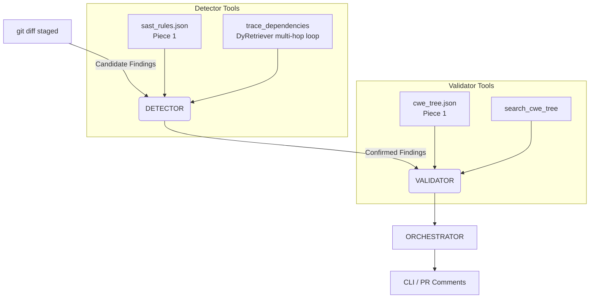

# AgenticSCR — Agentic Secure Code Review 🛡️

[](https://www.python.org/downloads/)
[](#)

An implementation of the AgenticSCR paper's dual-agent (**Detector** + **Validator**) secure code review architecture. It integrates with **DyRetriever's** multi-hop dependency tracing and is built using **LangGraph**.

**Status:** The core review pipeline (Pieces 1-6) and GitHub webhook integration (Phases 1-5) are complete. The pipeline receives Pull Requests, uses the local `qwen2.5:7b` via Ollama for code reviews, posts comments to GitHub, and displays runs on a local dashboard.

---

## 🏗️ Architecture

The system utilizes a dual-agent architecture to reduce false positives and deeply understand the code via multi-hop tracing.



### Key Concepts & Innovations
- **The Git Staging Trick:** To securely analyze Pull Requests locally without modifying the core pipeline, the webhook runner uses `git reset --soft <base_sha>` to manipulate Git pointers. This mimics a staged environment containing exactly the PR diff.
- **Optimized Shallow Clones:** When fetching PR code, the system uses a `--depth=50` shallow clone, minimizing bandwidth and ensuring lightning-fast webhook responses while retaining enough history for branch resolution.

---

## 🚀 Quick Start

### 1. Installation

```bash
pip install -r requirements.txt
pip install langchain-ollama
```

### 2. Testing
Run the full test suite using `pytest`. These tests run against scripted fake models, ensuring the pipeline's wiring is sound without requiring API keys.

```bash
python -m pytest toolset/ working_memory/ detector/ dyretriever/ validator/ orchestrator/ webhook/ dashboard/
```

### 3. Local CLI Review
Run the reviewer against a local repository with staged changes:

```bash
cd /path/to/some/repo
git add <files>
python /path/to/agenticscr/cli.py review . --json
```

### 4. GitHub Webhook Integration
Start the webhook receiver and dashboard to process real GitHub Pull Requests automatically.

```bash
export GITHUB_TOKEN=your_token
export GITHUB_WEBHOOK_SECRET=your_secret
uvicorn webhook.app:app --host 0.0.0.0 --port 8000
```
> **Dashboard:** Available locally at `http://localhost:8000/dashboard`

The webhook receiver securely verifies GitHub HMAC-SHA256 signatures, filters for PR events (`opened`, `synchronize`, `reopened`), and hands off the review to a background task to prevent GitHub timeout.

---

## 📂 Directory Map

| Path | Piece | What it is |
|---|---|---|
| `sast_rules/` | 1 | 50 CodeQL Python security rules (semantic memory for the Detector) |
| `cwe_tree/` | 1 | 839 MITRE CWE-1000 entries (semantic memory for the Validator) |
| `toolset/tools.py` | 2 | Diff/file/grep/folder tools, scoped + path-guarded per repo |
| `working_memory/` | 3 | LangGraph state schema, caching wrappers, `record_candidate_finding` |
| `dyretriever/` | — | AST function registry + multi-hop Select→Visit→Expand loop |
| `detector/` | 4 | Detector subagent: diff → rules → navigation → candidates |
| `validator/` | 5 | Validator subagent: candidates → CWE lookup → confirmed/rejected verdicts |
| `orchestrator/` | 6 | Sequences Detector→Validator, episodic JSONL log, output formatting |
| `webhook/` | P1 | FastAPI webhook receiver, PR parser, HMAC verification |
| `cli.py` | 6 | Command-line interface for local runs |

> **Note:** Every subdirectory has its own `README.md` with detailed build stories, architectural constraints, and bugs caught during development (such as late-binding and path-hardcoding issues).

---

## ⚠️ Known Gaps & Limitations

- **Model Evaluation:** The pipeline currently runs against scripted fake models in tests. Real-world detection accuracy (precision/recall) has not yet been benchmarked against a harness like SCRBench.
- **Language Support:** Both the SAST rules and the DyRetriever function extractor are **Python-only**.
- **Taxonomy Gaps:** 3 CWE IDs referenced by SAST rules are missing from the local taxonomy package.
- **Scope Resolution:** DyRetriever's callee-name resolution is strictly name-based and currently lacks context-aware scope resolution.

---

## 📚 References

This project references the following research papers:

1. **[AgenticSCR: An Autonomous Agentic Secure Code Review for Immature Vulnerabilities Detection](https://arxiv.org/abs/2601.19138)**
   *By Wachiraphan Charoenwet, Kla Tantithamthavorn, Patanamon Thongtanunam, Hong Yi Lin, Minwoo Jeong, Ming Wu*
   - **Summary:** Proposes an autonomous agentic secure code reviewer that uses security-focused semantic memory to detect context-dependent vulnerabilities early in the development lifecycle. By grounding reasoning in structured knowledge, AgenticSCR effectively identifies immature vulnerabilities before they fully manifest, achieving a 153% relative improvement over static LLM baselines in generating correct and relevant vulnerability reports.

2. **[Effective and Efficient Context Retrieval via Partial Dependency Graph for Repository-Level Code Generation](https://arxiv.org/abs/2608.01927)**
   *By Zhongxin Liu, Zhonghao Jiang, Zhifan Ye, Haoye Wang, Jiakun Liu, Xiaoxue Ren*
   - **Summary:** Introduces **DyRetriever**, a novel graph-based context retrieval method. Rather than relying on rigid, pre-computed static global dependency graphs, DyRetriever uses an LLM to iteratively build and evaluate partial dependency graphs on the fly. This dynamic, multi-hop reasoning improves both retrieval relevance and efficiency, yielding significant performance gains (up to 59.73% relative Pass@1 improvement) while being 7.4x faster than static graph methods.
